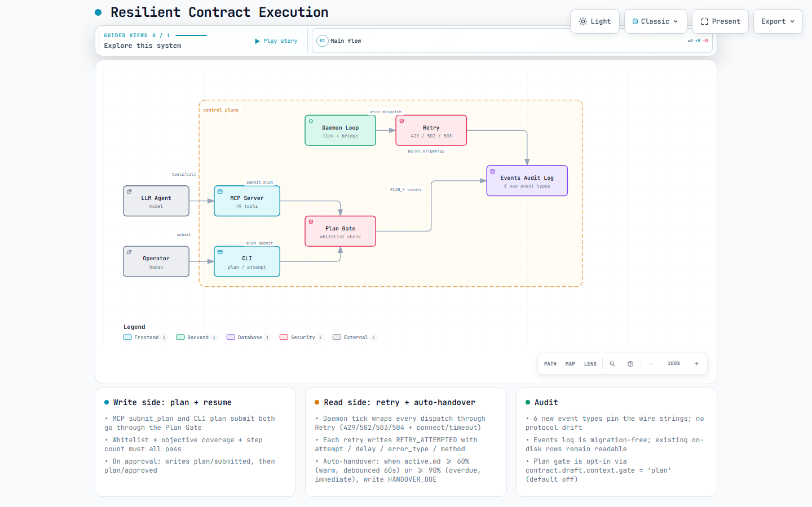

# LHGP — Deadline Contract Hub

> [中文说明](./README.zh-CN.md) · Protocol name: Long-Horizon Goal Protocol

**A multi-agent task contract runtime, independent of sessions and models, for sustained progress and evidence-based acceptance of long-horizon goals.**

Users specify outcomes, acceptance criteria, deadlines, authority, budgets and eligible executors in contracts.
LHGP holds multiple contracts locally, schedules attempts, retains handoff evidence and derives
contract outcomes from acceptance results. Workers may be agent CLIs or ordinary programs.

The scheduling core does not require an LLM. Models can draft plans, perform work or supply
semantic verification; contract persistence and scheduling do not depend on a model staying online.
Long-horizon goals are the main use case. Deadline Contract Hub is the product
name; it is implemented as a local task contract runtime.

This is a **Developer Preview**, not a production-stable release.
The [release audit](docs/evidence/release-readiness-2026-09-05.md) records reproduced release blockers;
the [executable plan](docs/RELEASE-PLAN.md) orders remediation and release.
Passing the existing test suite does not establish the absence of defects.

## Responsibilities

- **Contracts and authority:** persist outcomes and acceptance terms; constrain CLI, model and role eligibility.
- **Scheduling and deadlines:** calculate risk and decision points; dispatch, retry or request user intervention within approved limits.
- **Execution and handoff:** track attempts, leases and external handles; compile context for successor executors.
- **Acceptance and audit:** run typed checks, consume independent verifier evidence, retain decision and verification history.
- **Multiple contracts:** manage several contracts in one local runtime; associate stage contracts with a Goal using a submitted plan.
- **Several entry points:** CLI for people and scripts, MCP for agents, and platform plugin packaging.

See the [claims registry](quality/claims.json) and linked tests for evidence and coverage boundaries.
These features do not establish globally optimal scheduling, arbitrary parallel-write isolation
or autonomous semantic replanning.

## Goal, Contract, Attempt

| Object | Durable information | Boundary |
|---|---|---|
| Goal | Outcome, plan revisions, stages and progress | May relate to multiple stage contracts; current progression uses an externally supplied plan |
| Contract | Outcome, authority, budget, deadline and acceptance terms | Revisions retain history; workers cannot freely rewrite frozen terms |
| Attempt | One executor or verifier run, lease, external handle and evidence | Replaceable execution, not the owner of long-term state |

SQLite is authoritative. Context summaries and file projections support inspection and handoff;
they are not a shared free-text document that models must keep mutually consistent.

The typical path is approval → decision point → eligible executor → artifacts and handoff →
independent verification → satisfaction, budgeted repair or user escalation.
A scheduling tick need not call a model, and a worker exiting with code 0 does not prove contract acceptance.

## At a glance

The resilient-execution layer (`src/longtask/persistence/context.py`, `src/longtask/rpc/dispatch.py`, `src/longtask/cli/dispatch.py`, `src/lhgp/contracts/resume.py`, `src/lhgp/contracts/plan.py`) keeps long-running contracts alive across model crashes, 502 errors, and context exhaustion. Four streams cooperate: plan gate enforces a structured plan before any executor is contacted; retry handles transient RPC failures; auto-handover watches `active.md` size and fires before the context window dies; resume reads `active.md` + `handover.md` to spin up a fresh attempt.



See [`docs/diagrams/README.md`](docs/diagrams/README.md) for the full set: plan-gate enforcement, auto-handover data flow, handover lifecycle, and the architecture above.

## Start from a checkout

Requirements: Python 3.11+ and uv. Run from the repository root:

```text
uv sync --extra dev
uv run lhgp --version
uv run lhgp --data-dir runtime/quickstart doctor
```

This first example checks the **contract control plane without an LLM**. It does not approve a contract,
start an agent or spend model credits. It uses an isolated data directory.
Choose another contract ID when repeating it.

```text
uv run lhgp --data-dir runtime/quickstart prepare --contract-id lt-20260905-quickstart --title "First contract" --objective "Inspect the contract lifecycle" --deadline 2030-01-01T00:00:00+00:00
uv run lhgp --data-dir runtime/quickstart get lt-20260905-quickstart
uv run lhgp --data-dir runtime/quickstart cancel lt-20260905-quickstart
uv run lhgp --data-dir runtime/quickstart get lt-20260905-quickstart
```

Expected states: `drafted → cancelled`. The example deadline must remain in the future.
The abbreviated `prepare` command creates placeholder acceptance criteria;
it is not an unattended-execution template.

### Before delegating real work

An execution contract needs an absolute workspace path, meaningful acceptance checks,
a realistic workload estimate, and configured, launchable executor and independent verifier candidates.
Load a complete JSON draft with `prepare --file`, inspect its authority and budgets,
then approve it and start the daemon with the same data directory.
Approval does not imply immediate dispatch: state, policy and available budgets determine the next action.

A typed check's `target` is relative to the contract workspace.
Command checks use the daemon environment, not an automatically activated project virtual environment;
specify the interpreter path when needed.
Use `lhgp request-verification <id>` to inspect existing deliverables after execution budget exhaustion.
This requires an eligible verifier and remaining verification budget.
An enqueued request does not mean verification has started or passed.

See [SPEC §12](docs/LHGP-SPEC.md), the [local subprocess integration tests](tests/integration/test_attempt_runner.py),
and internal end-to-end runs with real CLI executors and an independent verifier.
Archived examples retain their original environment assumptions and are not portable configurations.

### MCP and plugin integration

The installed package provides `lhgp-mcp`. Make that executable discoverable by the MCP host;
`uv sync` alone does not add a virtual environment's commands to every application's PATH.
The repository's `.mcp.json` invokes `lhgp-mcp`, so the plugin requires an installed local companion runtime.
CLI, MCP and plugin packaging are entry points to the same runtime.

Canonical commands are `lhgp`, `lhgpd` and `lhgp-mcp`; legacy
`longtask`, `longtaskd` and `longtask-mcp` aliases remain available.
New installations default to `~/.lhgp`; see [roadmap P6](docs/LHGP-ROADMAP.md)
for legacy directory compatibility and migration. This positioning change does not rename packages,
commands or persisted data.

## Boundaries

- Single host, single user. Local RPC uses token authentication; this is not a network service for untrusted tenants.
- Deadlines drive scheduling and breach records, not guaranteed completion at an exact time.
- Local work cannot execute while the machine is powered off. Sleep wakeup depends on OS, hardware and permissions;
  the Windows L1 adapter has test coverage and other platforms explicitly report degradation.
- Adapter capability declarations are not a complete sandbox. Check actual file, network and process enforcement.
- Multiple contracts can coexist; arbitrary concurrent modification of a shared workspace is not guaranteed safe.
- The runtime does not autonomously interpret vague goals, continuously rewrite stage plans or optimize global resources.
- Cross-host and cross-network relay are outside this release and improvement scope. External notification delivery is not guaranteed.

## Checks and troubleshooting

```text
uv run python scripts/quality_gate.py
uv build
uv run python scripts/check_artifacts.py
```

The seven gates check formatting, lint, architecture, dependency policy, claims, types and test coverage.
The dependency policy gate is not a vulnerability-database audit; release also requires the
security checks in the [release plan](docs/RELEASE-PLAN.md).

For stalled work, start with `lhgp doctor` and `lhgp get <id>`;
inspect `decision_history`, `attempt_history` and `verification_history`.
`lhgp kill-switch --activate` prevents new dispatch; do not infer that every existing external process has exited.
Do not delete the state database to troubleshoot, or attach unredacted runtime directories to issues.

## Documentation

- [Specification](docs/LHGP-SPEC.md): protocol semantics; [ADR-004](docs/decisions/0004-contract-runtime-and-release-scope.md): positioning decision.
- [Release and improvement plan](docs/RELEASE-PLAN.md): current execution order; [roadmap](docs/LHGP-ROADMAP.md): broader milestones and history.
- [Release audit](docs/evidence/release-readiness-2026-09-05.md): checks performed and remaining gaps.
- [Resilient execution diagrams](docs/diagrams/README.md): visual overview of plan gate, retry, auto-handover, and resume.
- [Contributing](CONTRIBUTING.md), [security](SECURITY.md), [changelog](CHANGELOG.md), [Apache-2.0 license](LICENSE).

Implementation lives in both `src/lhgp/` and the compatibility namespace `src/longtask/`;
tests are in `tests/`, and wire schemas in `schemas/`.
The specification describes intended behavior; neither it nor the test count alone establishes production readiness.
