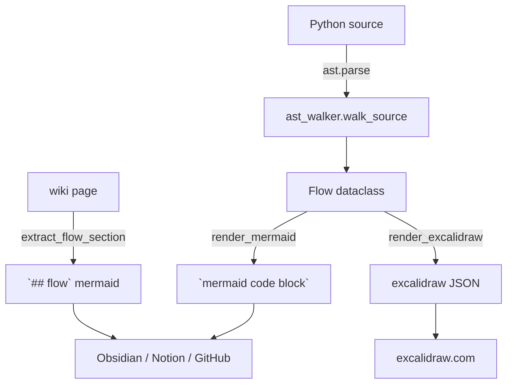

# playbook: flowgen（AST → Mermaid / Excalidraw）

`flowgen` 给你**结构图**。它从 `ast` 抽 `def`/`class`/调用，或读 wiki
页面里手写的 `## flow` mermaid 段。结构图补 wiki（叙事）和 memory
（学习）之间的空缺：**它回答"谁调谁"**，那是源码层最便宜的可视化。

## 三种用法的取舍

| 场景 | 走哪条 |
|---|---|
| 接手陌生模块 | `lhgp flow ast <file>` 先看主结构 |
| 给团队发图 | `--format=mermaid`（任何 Markdown 渲染器都吃） |
| 想手绘调整 | `--format=excalidraw` 导出 JSON，粘进 .excalidraw 文件 |
| 文档里已经有手写流程 | 直接 `lhgp flow wiki <page>` 抽出来 |

## CLI 速查

```bash
lhgp flow ast src/lhgp/memory/store.py            # Mermaid flowchart TD
lhgp flow ast src/lhgp/memory/store.py --format=excalidraw
lhgp flow ast src/lhgp/flow/ast_walker.py --module flow.walker
lhgp flow wiki topics/auto-mine
lhgp flow list-flow-pages
```

## 注意事项

- AST walker **不执行代码**；`TYPE_CHECKING` 的 import 一样作为
  `external` 出现，这是有意为之（静态图就该是静态的）
- `self.x()` 解析到本地 method；`Foo()` 解析到 class 节点（不展开
  `__init__`，避免噪音）
- 动态调用（`d['k']()`、lambda）一律 `external`，图至少显示依赖
- 自循环和重复边都丢掉；递归函数不会画自环
- Excalidraw 路径用确定性 ID（`node_0` / `text_0` / `arrow_0`），
  两次渲染 diff 干净

## 何时手写而不是 AST

AST 给你**结构**。以下情况写手写 `## flow`：

- 部署拓扑（哪些进程跑在哪些机器）
- 决策流（状态机、分支逻辑）
- 跨进程协议（消息时序）

这些不在代码里能看出来的，AST 抽不到。

## 相关

- `../index.md` — wiki 总览
- `../../skills/flowgen/SKILL.md` — 完整 skill 文档

## flow


