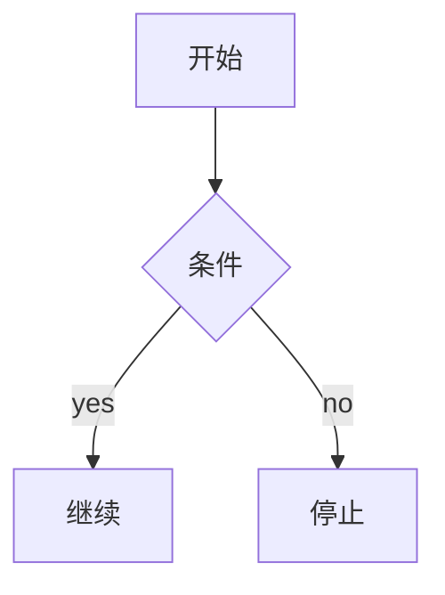

# flowgen（memory-and-wiki Phase 3）

代码与手写知识之间的**结构图**生成器。三种入口：

| 你想做的事 | 走哪条路 |
|---|---|
| 看一个 Python 模块里 `def`/`class`/调用关系 | `lhgp flow ast <file.py>` |
| 把上述渲染成可在 Obsidian/Notion 直接贴的图 | `--format=mermaid`（默认） |
| 把上述导出 Excalidraw 手绘风 JSON | `--format=excalidraw` |
| 读一个 wiki 页里的手写 `## flow` mermaid 块 | `lhgp flow wiki <page>` |
| 列出所有带 `## flow` 段的 wiki 页 | `lhgp flow list-flow-pages` |

## 1. 这解决什么问题

你接手一段不熟悉的代码时，前 5 分钟该问的两个问题：

1. **谁调谁** — `def foo` 真正用到了哪些库/函数
2. **怎么拼起来** — 模块之间的依赖、类的继承、方法的引用

`ast_walker` 把这些静态结构读出来，渲染成可读的图。手写 wiki
里的 `## flow` 块则承载**不能从代码推断的东西**（部署拓扑、决策流、
跨进程协议）。两路并用，结构走 AST，叙事走 wiki。

## 2. CLI 速查

```bash
# 把 src/lhgp/memory/store.py 渲染成 Mermaid
lhgp flow ast src/lhgp/memory/store.py

# 同样的源码导出 Excalidraw JSON
lhgp flow ast src/lhgp/memory/store.py --format=excalidraw

# 给模块一个非默认名（默认是文件 stem）
lhgp flow ast src/lhgp/flow/ast_walker.py --module flow.walker

# 读 wiki 页面的手写流程
lhgp flow wiki topics/auto-mine
lhgp flow wiki glossary
lhgp flow wiki topics/auto-mine --wiki-root ./docs/wiki

# 列出手写流程所在页面
lhgp flow list-flow-pages
```

## 3. 渲染约定

**AST 路径** — walker 会：

- 给每个 top-level `def`/`async def` 一个 `function` 节点
- 给每个 top-level `class` 一个 `class` 节点 + 类内每个 `def` 一个 `method` 节点
- 解析 `self.x()` / `cls.x()` → 本地 method
- 解析 `Foo()` → class 节点（不展开 `__init__`，避免噪音）
- 不能静态解析的下标/lambda 调用 → `external` 节点（确保依赖可见）
- 自循环和重复边都丢掉，递归函数不会画出自环

**Mermaid 形状** — module 是平行四边形，class/method 是圆角矩形，
external 是六边形。label 跟代码里的真实名字一致。

**Excalidraw 路径** — 4 列网格布局，确定性 ID（`node_0`/`text_0`/`arrow_0`），
所以两次渲染 diff 干净。

## 4. Wiki `## flow` 约定

任何 wiki 页都可以加一段：

```markdown
## flow


```

- 只取**第一个** `## flow` 段；如果需要更多图，拆页
- 必须是 `mermaid` 代码块；其他 fence 会被忽略
- `lhgp flow list-flow-pages` 只列出包含此段的页

## 5. 跟 memory / wiki 的关系

| 层 | 表达 | 来源 |
|---|---|---|
| **flow**（结构） | 谁调谁 | 代码 / 手写 |
| **memory**（学习） | 学到的规律 | 评价/反馈 auto-mine |
| **wiki**（叙事） | 人类知识 | 手写 markdown |

写新页面时，先 `lhgp flow ast <file>` 看结构，再用 `lhgp memory search`
拉相关 pattern，最后写进 wiki 的 prose。

## 6. 故障速查

| 现象 | 原因 |
|---|---|
| `error: file not found` | 路径相对 cwd 不对；用绝对路径或 `$(git rev-parse --show-toplevel)` 前缀 |
| 节点全部 `external` | walker 没在同文件找到 `def`/`class`；检查 `ast.parse` 是否能解析（语法错误） |
| `no '## flow' section` | 页面里没有这个段，或 fence 不是 `mermaid` |
| Excalidraw 渲染乱 | Excalidraw 视图需要把 `elements` 整个粘到 `.excalidraw` 文件或导入对话框 |
| `## flow` 改动没生效 | wiki parser 只取**第一个** `## flow` 段;如果页面里有旧段,删掉再写新的 |
